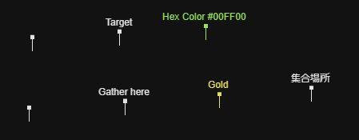
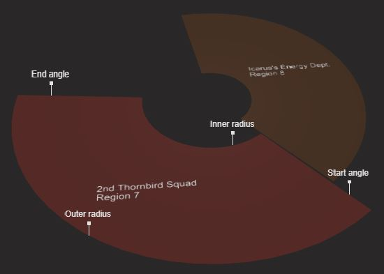
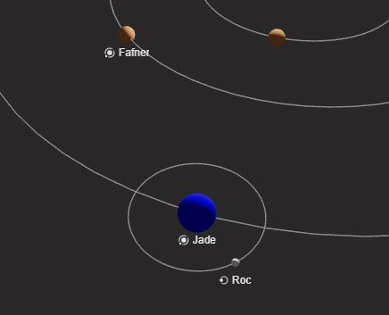

# Map Builder Syntax

The map builder uses a similar syntax to the in-game chat and mail. This allows us to easily copy & paste content into both directions.

## Marker

Syntax:

```
$marker
<point> [<color>] [<label>]
```

You can place markers after the `$marker` keyword. Each marker needs to be a new line. Colors and labels are optional. 

「`$marker`」キーワードの後に複数のマーカーを配置できます。各マーカーは新しい行に指定する必要があります。オプションで色とラベルが指定できます。

Example:



```
$marker
(1020,2020)
(1020,3040)
(2040,2020) Gather here
(2040,3040) Target
(3060,2020) #D Gold
(3060,3040) #c00FF00 Hex Color #00FF00
(4080,2020) 集合場所
```

(available colors are listed in the "Colors" section below)

## Regions

Syntax:

```
$region
<point><point><point><point> <number> [<color>] [<organization>]
```

You can place regions after the `$region` keyword. Each region needs to be a new line and requires four coordinates, a background color and a region number. The "organization" label is optional.

Coordinates need to be in the following order:
- a point to mark the inner radius
- a point to mark the outer radius
- a point to mark the start angle
- a point to mark the end angle

These coordinates do not necessarily have to touch the region area. For example, you can use the same coordinates for all regions that share the same radius.

これらの座標はかならずしも区域に接する必要はありません。同じ半径を共有する区域であれば座標も共有できます。

Example:



```
$region
(4653,3802)(3321,2851)(5610,3101)(2838,4696) 7 #c87372C 2nd Thornbird Squad
(4927,4483)(4653,6087)(4324,5779)(5398,3401) 8 #c694226 Icarus's Energy Dept.
```

## Planets

Syntax:

```
$planet
<point>[<point>] [<size>] [<color>] [<name>]
```

You can place planets after the `$planet` keyword. The optional second point marks the center of the orbit. "size", "color" and "name" are optional. "size" can be one of `large`, `medium`, `small` and defaults to `medium`.

Example:



```
$planet
(4340,4143)
(3814,4207) Fafner
(3978,3380) large #B Jade
(4053,3222)(3978,3380) small #W Roc
```

## Space Stations

Syntax:

```
$station
<point> [<type>] [<level>] [<color>] [<name>]
```

You can place various types of space stations after the `$station` keyword. "type" can be one of `city`, `stronghold` or `default` if specified. "level" is optional but should be specified for type `city` in order to have the right icon and visibility based on zoom level. 

## Areas

Syntax:

```
$area
<point><point> [<type>] [<color>] [<name>]
```

You can place various types of areas after the `$area` keyword. Each area needs two corner points. Both points are automatically rounded to fit the area onto the grid. "type" can be one of `city` or `default` if specified. Areas become visible at different zoom levels depending on their type.

## Player Bases

Syntax:

```
$base
<point> [<color>] [<name>]
```

## Player Outposts

Syntax:

```
$outpost
<point> [<color>] [<name>]
```

## Mining Platforms

Syntax:

```
$platform
<point> <type> [<color>] [<name>]
```

You can place mining platforms after the `$platform` keyword. It needs a point for the bottom left corner. The given point will be rounded to fit the platform onto the grid. "type" can be one of `basic`, `intermediate`, `advanced` or in short form `bmp`, `imp` or `amp`. 

## Colors

Chat colors:

<div style="display:inline-flex;gap:8px;background-color:#292828;margin-bottom:8px">
<div style="color:red;">#R</div>
<div style="color:blue;">#B</div>
<div style="color:gold;">#D</div>
<div style="color:green;">#G</div>
<div style="color:black;">#K</div>
<div style="color:orange;">#O</div>
<div style="color:pink;">#P</div>
<div style="color:purple;">#U</div>
<div style="color:white;">#W</div>
<div style="color:yellow;">#Y</div>
<div style="color:white;">#c&lt;hex color&gt;</div>
</div>

Example region colors:

<div style="display:inline-flex;gap:4px;color:white;margin-bottom:8px">
<div style="background-color:#87372C;">#c87372C</div>
<div style="background-color:#873E2C;">#c873E2C</div>
<div style="background-color:#985036;">#c985036</div>
<div style="background-color:#694226;">#c694226</div>
<div style="background-color:#625828;">#c625828</div>
</div>

Default region color:

<div style="display:inline-flex;color:white;margin-bottom:8px">
    <div style="background-color:#985036;">#c985036</div>
</div>

(actual region colors have an alpha value added based on zoom level)

（実際の区域カラーにはズームレベルによってアルファ値が追加されます）
