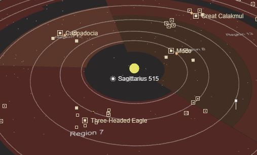
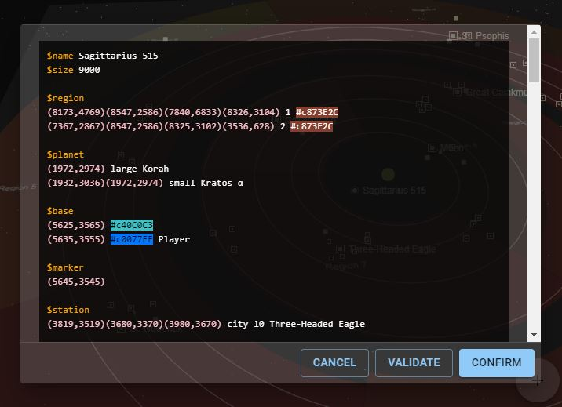
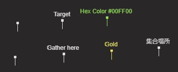
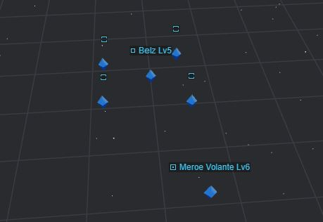
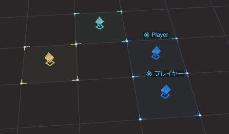
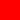
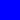
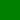
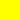
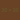

# Map Builder



The map builder can be used to visualize and share a star system. Its content, the map data, is described in text form and the syntax for it is described on this page.

## Syntax

The map builder uses a similar syntax to the in-game chat and mail. Each "point" on the map is represented using in-game coordinate format, e.g. `(1234,1234)`. Colors are indicated using escape codes like `#R` or `#cFF0000`. Line breaks inside various labels can be inserted using `#r`. This allows us to copy and paste some of the content into both directions. 

Special keywords are defined for placing map content, e.g. `$marker` for placing marker points. Any line after such a keyword belongs to the same content type. You do not have to repeat these keywords for every line of content.



Keywords:

- `$marker` for placing marker points
- `$region` for defining region areas
- `$planet` for placing planets and their orbit
- `$station` for building space stations and cities
- `$base` for placing player bases
- `$outpost` for placing player outposts
- `$platform` for playing mining platforms
- `$name` to name the map
- `$serverName` for server name / name of the star system
- `$size` for the size of the coordinate system

(these keywords are explained in more detail below)

Comments can be added after a double slash.

## Marker



Syntax:

```
$marker
<point> [<color>] [<label>]
```

You can place markers after the `$marker` keyword. Each marker needs to be a new line. Colors and labels are optional. 

Example:

```
$marker
(1020,2020)
(1020,3040)
(2040,2020) Gather here
(2040,3040) Target
(3060,2020) #D Gold
(3060,3040) #c00FF00 Hex Color #00FF00
(4080,2020) 集合場所
```

(available colors are listed in the "Colors" section below)

## Regions


Syntax:

```
$region
<point><point><point><point> <number> [<color>] [<organization>]
```

You can place regions after the `$region` keyword. Each region needs to be a new line and requires four coordinates, a background color and a region number. The "organization" label is optional.

Coordinates need to be in the following order:
- a point to mark the inner radius
- a point to mark the outer radius
- a point to mark the start angle
- a point to mark the end angle

These coordinates do not necessarily have to touch the region area. For example, you can use the same coordinates for all regions that share the same radius.

Example:

```
$region
(4653,3802)(3321,2851)(5610,3101)(2838,4696) 7 #c87372C 2nd Thornbird Squad
(4927,4483)(4653,6087)(4324,5779)(5398,3401) 8 #c694226 Icarus's Energy Dept.
```

## Planets


Syntax:

```
$planet
<point>[<point>] [<size>] [<color>] [<name>]
```

You can place planets after the `$planet` keyword. The optional second point marks the center of the orbit. "size", "color" and "name" are optional. "size" can be one of `large`, `medium`, `small` and defaults to `medium`.

Example:

```
$planet
(4340,4143)
(3814,4207) Fafner
(3978,3380) large #B Jade
(4053,3222)(3978,3380) small #W Roc
```

## Space Stations



Syntax:

```
$station
<point>[<point><point>] [<type>] [<level>] [<color>] [<name>]
```

You can place various types of space stations after the `$station` keyword. "type" can be one of `city`, `subCity`, `stronghold`, `dock` or `default` if specified. "level" is optional but should be specified for type `city` in order to have the right icon and visibility based on zoom level.

Two additional points can be specified to mark the area around the station.

Player bases, outposts and mining platforms have their own dedicated keyword (`$base`, `$outpost` and `$platform`). `$station` is mostly used for creating cities and miscellaneous NPC stations.

Example:

```
$station
(8530,4929) city 3 Koga
(4096,3591)(4010,3571)(4130,3690) city 6 #c0077FF Meroe Volante
(4090,3616) subCity 5 #c0077FF Belz
(4082,3610) stronghold #c0077FF
```

## Player Bases



Syntax:

```
$base
<point> [<color>] [<name>]
```

You can place player bases after the `$base` keyword. The given point is automatically rounded to fit the base onto the grid. Bases are only visible at a certain zoom level.

## Player Outposts

Syntax:

```
$outpost
<point> [<color>] [<name>]
```

You can place player outposts after the `$outpost` keyword. Each line will place a 1x1 area and a space station with an outpost icon.

## Mining Platforms

Syntax:

```
$platform
<point> <type> [<color>] [<name>]
```

You can place mining platforms after the `$platform` keyword. Each platform needs at least a center point and a type. The given point will be rounded to fit the platform onto the grid. "type" can be one of `basic`, `intermediate`, `advanced` or in short form `bmp`, `imp` or `amp`. The station will have a default name based on the given type. An optional "name" can be provided to override the type specific default name. Each line will place a 2x2 area and a space station with a platform type specifc icon.  

## Basic map properties

Syntax:

```
$name <name>
$serverName <name>
$size <size>
```

Basic map properties are optional.

Use the `$name` keyword to give your map a name for the map selection screen.

Use the `$serverName` keyword to name the server / star system. The server name gets displayed at the center of your map, below the sun.

Use the `$size` keyword to specify the overall map size. Most maps have a "size" of 9000, which is also the default value if no size is specified. You can find the size by checking the top right corner coordinate of your map. The given size will also determine the center point of your star system, e.g. "(4500,4500)" for a size of 9000. The sun will be placed at the center point, with the given server name as label if specified.

Example:

```
$name My Awesome Map
$serverName V1357 Leo
$size 9000
```

## Colors

Chat colors:

 #R
 #B
 #D
 #G
 #K
 #O
 #P
 #U
 #W
 #Y
 #c00BBFF (hex color)

Example player colors:

 #c4D85BE
 #cBA6E34
 #c40C0C3
 #cBE393A
 #cCC3FA5
 #cB4C402
 #c5854A1

Example region colors:

 #c87372C
 #c873E2C
 #c985036
 #c694226
 #c625828

(actual region colors have an alpha value added based on zoom level)

Default colors:

 regions (#c)
 planets (#cE3A06D)
 player (#c4D85BE)
 areas & stations (#cD0AE55)
