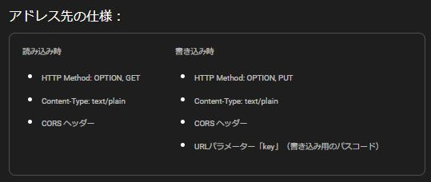

# 星系マップ　編集ガイド


目次:
- [基本構文](#基本構文)
- [キーワード一覧](#キーワード一覧)
- [マーカー](#マーカー)
- [区域](#区域)
- [惑星](#惑星)
- [スペースステーション](#スペースステーション)
- [プレイヤー基地](#プレイヤー基地)
- [前哨基地](#前哨基地)
- [採掘プラットフォーム](#採掘プラットフォーム)
- [基本プロパティ](#基本プロパティ)
- [カラーコード](#カラーコード)
- [コードエディタ](#コードエディタ)
- [バックエンド](#バックエンド)
- [マップのシェア](#マップのシェア)

## 基本構文

星系マップの編集には専用のマークアップ言語を使います。

基本的にはゲーム内のチャットやメールで使うテキスト構文をベースにしています。マップ編集で使う座標のフォーマットはゲーム内の「座標コピー」で得られるフォーマットと同じです（例：`(1234,1234)`）。色を指定する時もゲーム内のチャットと同じカラーコードを使います（例：`#R`/`#cFF0000`など）。

各種マップコンテンツはそれぞれ一つ設置するのに１行だけ使います。ラベルなどのテキストで改行が必要な場合はゲーム内のチャットでも使う「`#r`」を使います（例：`1行目#r2行目`）。

ゲーム内で使われている構文に合わせることでコンテンツの一部を双方向にコピー＆ペーストできます。

マップコンテンツの配置には特定のキーワードを使います。キーワードの後に続く行は別のキーワードが指定されるまで同じコンテンツとして扱われます。例えば複数のマーカーを設置する際には「`$marker`」キーワードを一度だけ指定して、後に続く行は座標だけで足ります。

例：

```
$marker
(1020,2020)
(1020,3040)
$planet
(1234,5678)
(8765,4321)
```

（マーカー用の座標が二つ、惑星用の座標が二つ）

使用したキーワードによってその後に続く行の構文が変化します（例えばマーカーの場合は座標が求められます）。構文を無視したコメントはダブルスラッシュの後に書けます。

例：

```
$marker // これはコメント
// この行はコメント
(1020,2020) // これもコメント
```

## キーワード一覧

- `$marker` （マーカー）
- `$region` （区域）
- `$planet` （惑星）
- `$station` （スペースステーション/都市/防衛拠点など）
- `$base` （プレイヤー基地）
- `$outpost` （前哨基地）
- `$platform` （採掘プラットフォーム）
- `$name` （マップ名）
- `$serverName` （サーバー名/星系名）
- `$size` （マップサイズ）

各キーワードに続く行の構文に関しては以下で個別に説明します。

## マーカー


構文：

```
$marker
<座標> [<色>] [<ラベル>]
```

「`$marker`」キーワードの後に​​マーカーを指定できます。1行1マーカーです。色とラベルはオプションです。

Example:

```
$marker
(1020,2020)
(1020,3040)
(2040,2020) Gather here
(2040,3040) Target
(3060,2020) #D Gold
(3060,3040) #c00FF00 Hex Color #00FF00
(4080,2020) 集合場所
```

(available colors are listed in the "Colors" section below)

## 区域


構文：

```
$region
<座標><座標><座標><座標> <番号> [<色>] [<ラベル>]
```

「`$region`」キーワードの後に​​区域を指定できます。区域の指定には四か所の座標と区域番号が必要です。色とラベルはオプションです。

座標の順番：
- 内側の半径をマークする座標
- 外側の半径をマークする座標
- 開始角度をマークする座標
- 終了角度をマークする座標

これらの座標は半径と角度をマークするもので、区域エリアに接する必要はありません。同じ半径や角度を持つ区域であれば座標の使いまわしも可能です。

サンプル：

```
$region
(4653,3802)(3321,2851)(5610,3101)(2838,4696) 7 #c87372C 2nd Thornbird Squad
(4927,4483)(4653,6087)(4324,5779)(5398,3401) 8 #c694226 Icarus's Energy Dept.
```

## 惑星


構文：

```
$planet
<座標>[<座標>] [<サイズ>] [<色>] [<ラベル>]
```

「`$planet`」キーワードの後に惑星を指定できます。二つ目の座標はオプションで軌道の中心を示します。指定されない場合は中央の太陽を中心とします。オプションでサイズと色とラベルが指定できます。サイズは`large`/`medium`/`small`から選べて、デフォルトは「`medium`」です。

サンプル：

```
$planet
(4340,4143)
(3814,4207) Fafner
(3978,3380) large #B Jade
(4053,3222)(3978,3380) small #W Roc
```

## スペースステーション


構文：

```
$station
<座標>[<座標><座標>] [<タイプ>] [<レベル>] [<色>] [<ラベル>]
```

「`$station`」キーワードの後に各種スペースステーションを指定できます。

タイプ：
- `city` 都市
- `subCity` サブ都市
- `stronghold` 防衛拠点
- `dock` 結合ステーション
- `default` その他

レベル指定はオプションですが、都市の場合はアイコンと詳細度が変化するので指定推奨です。

座標の順番：
- スペースステーションの座標（大型都市の場合はメイン都市の座標）
- ステーションエリアをマークするための座標（オプション）
- ステーションエリアをマークするための座標（オプション）

タイプが`dock`でレベルも指定されている場合は自動的に１ｘ１マスのステーションエリアが配置されます。

プレイヤー基地/前哨基地/採掘プラットフォームの指定には別の専用のキーワードを使います（`$base`/`$outpost`/`$platform`）。

サンプル：

```
$station
(8530,4929) city 3 Koga
(4096,3591)(4010,3571)(4130,3690) city 6 #c0077FF Meroe Volante
(4090,3616) subCity 5 #c0077FF Belz
(4082,3610) stronghold #c0077FF
```

## プレイヤー基地


構文：

```
$base
<座標> [<色>] [<ラベル>]
```

「`$base`」キーワードの後にプレイヤー基地を指定できます。基地をマスに納めるための細かい座標調整は自動で行われます。１ｘ１マスのステーションエリアも自動的に設置されます。プレイヤー基地はある程度ズームインしないと表示されません。

サンプル：

```
$base
(5615,3555) #cF7C360
(5625,3565) #c40C0C3
(5635,3555) #c0077FF Player
(5635,3545) #c0077FF プレイヤー
```

## 前哨基地

構文：

```
$outpost
<座標> [<色>] [<ラベル>]
```

「`$outpost`」キーワードの後に前哨基地を指定できます。基地をマスに納めるための細かい座標調整は自動で行われます。１ｘ１マスのステーションエリアも自動的に設置されます。前哨基地はある程度ズームインしないと表示されません。

サンプル：

```
$outpost
(5615,3555) #cF7C360
(5625,3565) #c40C0C3
(5635,3555) #c0077FF My warp point
(5635,3545) #c0077FF ワープ用
```

## 採掘プラットフォーム


構文：

```
$platform
<座標> <タイプ> [<色>] [<ラベル>]
```

「`$platform`」キーワードの後に採掘プラットフォームを指定できます。プラットフォームの細かい座標調整は自動で行われます。２ｘ２マスのステーションエリアも自動的に設置されます。色とラベルはオプションです。ラベルは指定されない場合、タイプを基に自動的に追加されます。

タイプ：
- `basic` 初級プラットフォーム
- `intermediate` 中級プラットフォーム
- `advanced` 上級プラットフォーム
- `bmp` 初級プラットフォーム
- `imp` 中級プラットフォーム
- `amp` 上級プラットフォーム

サンプル：

```
$platform
(5610,3550) basic #cF7C360
(5640,3550) intermediate #c40C0C3
(5670,3550) advanced #c40C0C3
(5620,3580) bmp #c0077FF
(5650,3580) imp #c0077FF Intermediate Mining Platform
(5680,3580) amp #c0077FF 上級プラットフォーム
```

## 基本プロパティ

構文：

```
$name <名前>
$serverName <名前>
$size <サイズ>
```

基本プロパティはオプションです。

`$name`でマップ名を指定できます。

`$serverName`でサーバー名/星系名を指定できます。指定された名前は星系の中央にある太陽のラベルとしても表示されます。

`$size`でマップのサイズが指定できます。デフォルトは9000です。マップサイズは一番右上の座標から取得できます。マップサイズを基に中央に太陽が設置されます。軌道の中心が指定されていない惑星にも影響します。

サンプル：

```
$name ぎょしゃマップ
$serverName ぎょしゃ座V508
$size 9000
```

## カラーコード

チャットカラー：

 #R
 #B
 #D
 #G
 #K
 #O
 #P
 #U
 #W
 #Y
 #c00BBFF (hex color)

プレイヤー用カラーサンプル：

 #c4D85BE
 #cBA6E34
 #c40C0C3
 #cBE393A
 #cCC3FA5
 #cB4C402
 #c5854A1

区域用カラーサンプル：

 #c87372C
 #c873E2C
 #c985036
 #c694226
 #c625828

（実際の区域カラーはズームレベルによってアルファ値が追加されて半透明になっています）

各種デフォルトカラー：

 regions (#c)
 planets (#cE3A06D)
 player (#c4D85BE)
 areas & stations (#cD0AE55)

## コードエディタ


「星系マップ」ページにはコードエディタが内臓されています。専用のマークアップ言語に合わせてキーワードなどのカラーハイライトと構文のチェックが行われます。構文に関するエラーがある場合はエラーメッセージと行の番号が表示されます。

内臓コードエディタを使ってマップデータの編集が行えます。編集結果はマップですぐに表示されますが、データを保存するにはまずバックエンドの設定を行う必要があります（直接リンクでマップを開いた場合は設定する必要はありません）。

## バックエンド

当サイト「インラグデータ」はデータベースを持ちません。「クライアント側オンリー」です。ユーザー登録と認証もありません。匿名での使用を前提としています。ですが、星系マップに記された戦略的な情報などを組織内でのみ共有したい場合は最低限のアクセス制限も求められます。匿名での使用とアクセス制限の両立が難しいので、今は組織毎に「バックエンドを自分で用意する」と言う形を取っています。

マップの書き込み制限、保存先の用意、アドレスのシェア管理、マップの無効化などは独自に行ってもらいます。当サイトは、情報漏えいに関して一切の責任を負いません。

バックエンドアドレスの設定は「星系マップ」ページ内の「バックエンドの設定」フォームで行います。



バックエンド側に求められる仕様はフォームの下にも表示されています。

サイト内のコードエディタを使ってマップを保存する場合はパスコードの入力が求められます。パスコードはマップと共にバックエンド側に送信され、書き込みを制限するために使えます。

## マップのシェア

マップを開いた後にブラウザのアドレスバーから直接リンクを取得できます（ブックマーク可能）。

シェアする範囲には気を付けてください。直接リンクにはバックエンドへのアドレスも内臓されています。
